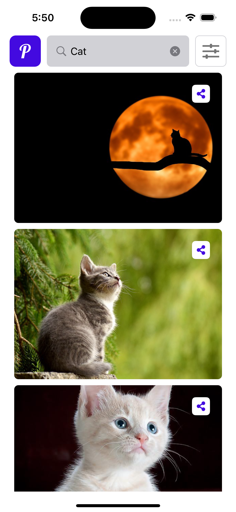
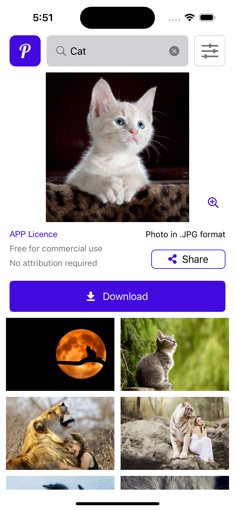

# Pixabay Free Images Search App
-----------------------------------------------------

 
 
 

## Table of Contents
1. [Description](#description)
2. [Features](#features)
3. [Requirements](#requirements)
4. [Tech Stack](#tech-stack)
5. [Installation](#installation)
6. [Design](#design)
7. [API Documentation](#api-documentation)
8. [Third-party libraries](#third-party-libraries)
9. [License](#license)

## Description 
This is an iOS application that allows users to search for images on Pixabay, view them, and share the image links. The application also includes an image cropping feature for both local and remote images. 

## Features 
- Search for pictures based on a topic of interest.
- View search results in a grid format.
- Share image links directly from the app.
- Open an image on a separate screen for an enhanced view.
- Zoom images up to x10 magnification and as minimum as half-screen.
- Cache images for quicker access and less data usage.
- Fetch and display local images/photos.
- Crop selected images and save them.

## Requirements 
- Minimum iOS 12

## Tech Stack 
- Swift
- UIKit
- Auto Layout
- MVC
- Pixabay API
- Third-party libraries
    - Cocoapods
    - TOCropViewController
    - netfox

## Installation 
1. Clone the repository
2. Install the dependencies with Cocoapods: `pod install`
3. Open the `.xcworkspace` file in Xcode
4. Build and run the app

## Design 
You can find the design for this project on [Figma](https://www.figma.com/file/sos7ujMGWNicAbQXKUL4Li/Images-search)

## API Documentation 
Pixabay API documentation can be found [here](https://pixabay.com/api/docs/)

## Third-party libraries 
- [TOCropViewController](https://github.com/TimOliver/TOCropViewController): Used for the image cropping feature.
- [netfox](https://github.com/kasketis/netfox): A lightweight, one-line setup, network debugging library in Swift. Used for on-device requests debugging (for debug builds only).

## License 
This project is licensed under the MIT License.

